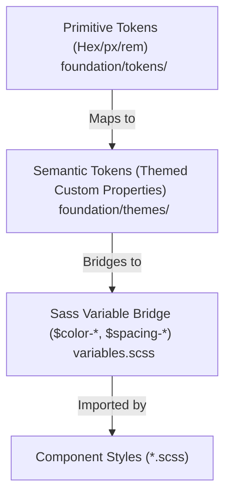

# Style System Architecture: CSS Custom Properties & Sass Variable Bridge

This directory contains the core styling architecture for the frontend client application. The project follows a **decoupled, 3-tiered design token system** built on native CSS Custom Properties, bridged with Sass variables for backward compatibility and static linting support.

---

## Architecture Overview



---

## The 3-Tiered Token System

### 1. Primitive Tokens (`foundation/tokens/`)

Primitives are raw, contextless values declared under `:root`. They define the absolute bounds of our design system (e.g., specific HEX codes, spacing scales, typography metrics, and border radii).

- `_colors.scss`: Global color palette values (e.g., `--primi-gray-100: #f3f4f6;`).
- `_spacing.scss`: Fixed spacing sizes (e.g., `--primi-spacing-md: 16px;`).
- `_radius.scss`: Layout border-radii values.
- `_shadows.scss`: Consistent shadow presets.
- `_typography.scss`: Base font-family stacks and font-size scaling.
- `_z-index.scss`: Global z-index stack layers to prevent layout overlaps.

### 2. Semantic Tokens & Themes (`foundation/themes/`)

Semantic tokens map primitives to context-specific roles or UI intents (e.g., `--color-primary`, `--color-bg-app`). This tier supports runtime themes (like Light/Dark mode transitions) by swapping custom property definitions without modifying components.

- `_light.scss`: Mappings for the default light theme under `:root` (e.g., `--color-primary: var(--primi-gray-900);`).
- `_dark.scss`: Mappings for the dark theme activated under `[data-theme='dark']` and `@media (prefers-color-scheme: dark)` (e.g., inverted neutral scales, adjusted status tints, and deeper shadows).

### 3. Sass Variable Bridge (`variables.scss`)

This file is the developer entry point. It imports the foundation layers and maps legacy Sass variables (`$`) directly to native CSS custom properties.

- Example: `$color-primary: var(--color-primary);`
- **Why this bridge?**
    1. **Stylelint Support**: Ensures strict compliance with our linter, checking that components don't declare raw values.
    2. **Backward Compatibility**: Allows legacy component styling using standard `$color` variables to compile cleanly into native runtime properties.
    3. **Responsive Breakpoints**: Declares modern media-query mixins (`mobile`, `tablet`, `desktop`) for responsive styles.

---

## How to Use

### SCSS Variables & Mixins

When styling components, always use modern `@use` rules to reference variables and mixins. **Never use raw hex colors, pixel values, or hardcoded z-indexes.**

```scss
@use '@/styles/variables' as variables;

.custom-card {
    // 1. Decoupled semantic colors
    background-color: variables.$color-white;
    border: 1px solid variables.$color-gray-100;

    // 2. Decoupled layout spacing and radius
    padding: variables.$spacing-md;
    border-radius: variables.$radius-medium;

    // 3. Decoupled typography & z-index
    font-size: variables.$font-size-sm;
    z-index: variables.$z-base;

    // 4. Built-in transitions & responsive mixins
    @include variables.transition-ease;

    @include variables.mobile {
        padding: variables.$spacing-sm;
    }
}
```

### Modern Sass Modernization Rule

Because Sass variables now point to native runtime CSS custom properties, standard Sass functions like `color.adjust`, `lighten()`, or `darken()` **will fail** to compile at build time.

Instead, use native CSS `color-mix()` for mixing/shading colors:

```scss
// Do NOT use: background-color: color.adjust(variables.$color-primary, $lightness: 10%);
// Use modern native CSS:
background-color: color-mix(in srgb, variables.$color-primary 90%, white);
```
